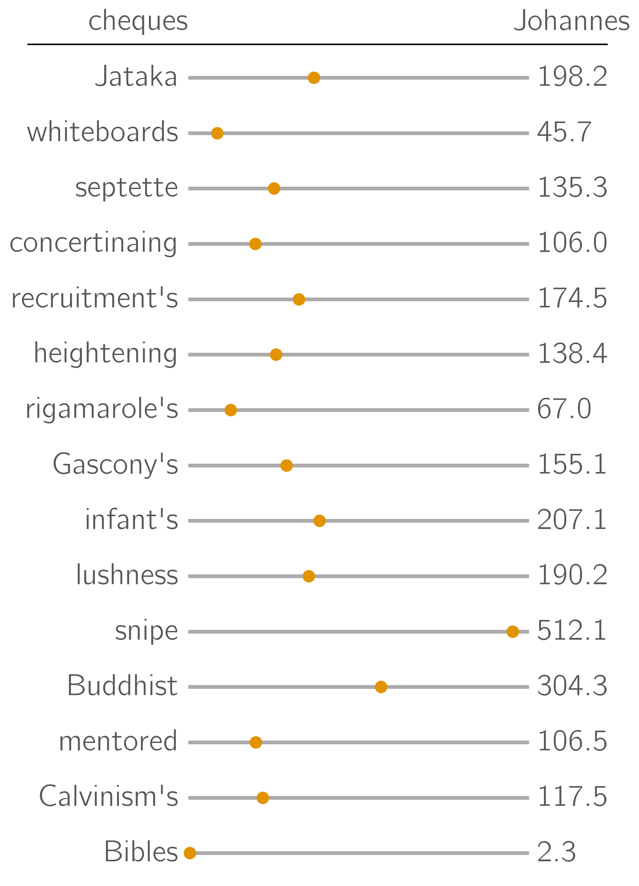
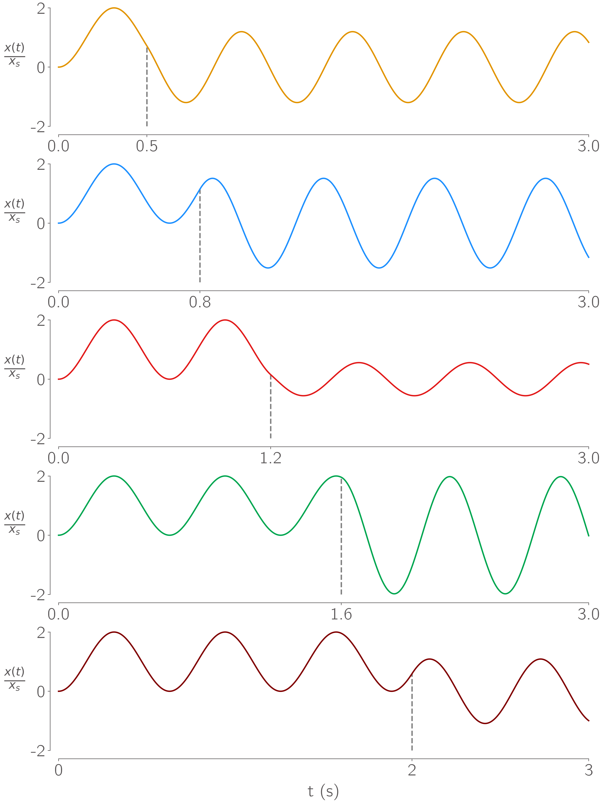
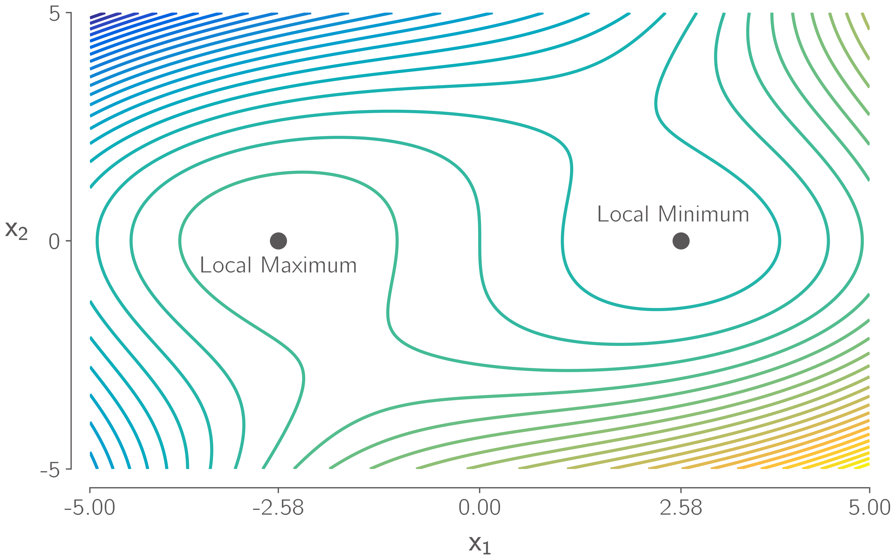
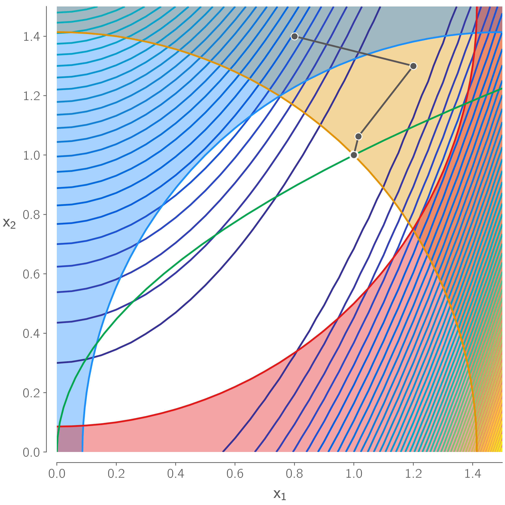

# NicePlots
## A collection of small tweaks to improve Python / plotting


[](https://mdolab-niceplots.readthedocs-hosted.com/en/latest)
![PyPI][https://img.shields.io/pypi/v/niceplots](https://pypi.org/project/niceplots/)
![PyPI - Downloads][https://img.shields.io/pypi/dm/niceplots](https://pypi.org/project/niceplots/)
[](https://github.com/psf/black)

 
 


### How do I install?

Niceplots can be pip installed directly from PyPI

```shell
pip install niceplots
```

#### If you want to make changes

* Clone this repository, then enter the folder in the command line terminal.
* Enter `pip install -e .` within the `niceplots` folder.

#### Font installation (optional)

Niceplots will try and use the [computer modern bright](https://tug.org/FontCatalogue/computermodernbright/) font for the best looking plots so be sure to install it as a system font if you want to recreate the style of the plots above.
Otherwise, niceplots will still work but revert back to the matplotlib default sans-serif font, DejaVu Sans.

To install the font on Ubuntu, run the following commands:
```
sudo apt-get update
sudo apt-get install fonts-cmu
```
Arch linux users can get the font by installing the `otf-cm-unicode` package from AUR.

If niceplots doesn't recognize the font, it might be necessary to delete Matplotlib's font cache file from its location on your computer, likely in `~/.cache/matplotlib`

### How do I get set up?

* Use `import niceplots` at the top of a file where you would like to use any function defined in this package.
* Use `niceplots.setRCParams()` to set some matplotlib defaults for nice looking plots. Set `dark_mode=True` and `set_background_color=True` to make plots with a dark background.
* Use `niceplots.All()` after all the plot commands to apply the niceplot standards on the figure.
* To use the Matlab colormap "parula", execute `from niceplots import parula` then use `parula.parula_map` as your colormap within your plotting script. See the contour plot example code for an example of this.

### Do you have docs?

Sort of, you can find our examples gallery and api documentation [here](https://mdolab-niceplots.readthedocs-hosted.com/en/latest)

### Contribution guidelines

* Make any changes you see fit. Please fork your own version and submit a pull request.

### Who do I talk to?

* Alasdair Gray, alachris@umich.edu
* Eytan Adler, eytana@umich.edu
* Eirikur Jonsson eirikurj@umich.edu
